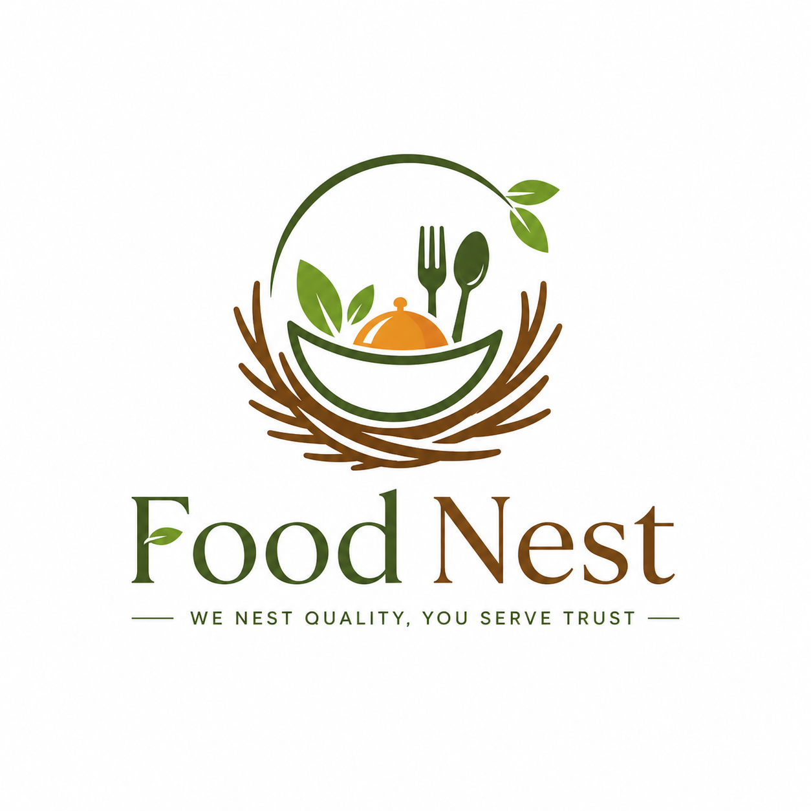

<div align="center">
  

  <h1>FoodNest Client</h1>
  <p>
    A modern role-based food ordering platform frontend built with Next.js,
    TypeScript, Tailwind CSS, Better Auth, and reusable Radix UI components.
  </p>

  <p>
    <a href="https://food-nest-client.vercel.app">Live Frontend</a>
    |
    <a href="https://foodnest-server.onrender.com">Live Backend</a>
    |
    <a href="https://drive.google.com/file/d/12D4k0QztRpl2FCdRIA1xqe82m1IjgwnU/view?usp=drive_link">Demo Video</a>
  </p>

  <p>
    
    
    
    
    
  </p>
</div>

## Project Overview

FoodNest is a full-stack food ordering system designed for customers, food
providers, and administrators. This repository contains the frontend client,
which provides public browsing, authentication, cart management, order tracking,
role-aware dashboards, provider workflows, and admin management screens.

The application focuses on a clean user experience, responsive layouts,
structured API integration, and maintainable feature-driven code organization.

## Important Links

| Resource            | URL                                                                                                        |
| ------------------- | ---------------------------------------------------------------------------------------------------------- |
| Frontend Repository | [github.com/FahimMuntasir0417/FoodNest-Client](https://github.com/FahimMuntasir0417/FoodNest-Client)       |
| Backend Repository  | [github.com/FahimMuntasir0417/FoodNest-Server](https://github.com/FahimMuntasir0417/FoodNest-Server)       |
| Frontend Live       | [food-nest-client.vercel.app](https://food-nest-client.vercel.app)                                         |
| Backend Live        | [foodnest-server.onrender.com](https://foodnest-server.onrender.com)                                       |
| Demo Video          | [Google Drive demo](https://drive.google.com/file/d/12D4k0QztRpl2FCdRIA1xqe82m1IjgwnU/view?usp=drive_link) |

## Demo Access

These accounts are intended for project review and demonstration only. Do not
reuse these credentials for production or personal accounts.

| Role     | Email                    | Password    |
| -------- | ------------------------ | ----------- |
| Admin    | `admin@admin.com`        | `admin1234` |
| Provider | `hixemom794@azeriom.com` | `12345@#$`  |
| Customer | `y41lhw4kb3@ozsaip.com`  | `12345@#$`  |

## Core Features

- Public meal browsing with detail pages, pricing, categories, availability,
  providers, and reviews.
- Customer cart flow with draft cart creation, quantity management, checkout
  entry, and order tracking.
- Role-based authentication and protected dashboards for customer, provider,
  and admin users.
- Provider dashboard for meal, category, and order management workflows.
- Admin dashboard for users, meals, categories, and platform-wide orders.
- Review and rating flows for meals.
- Responsive navigation, dark mode support, reusable UI primitives, and
  polished empty, loading, and error states.

## Tech Stack

| Area                 | Technology                                      |
| -------------------- | ----------------------------------------------- |
| Framework            | Next.js 16, React 18                            |
| Language             | TypeScript                                      |
| Styling              | Tailwind CSS 4                                  |
| UI Primitives        | Radix UI, shadcn-style components, Lucide icons |
| Authentication       | Better Auth                                     |
| Forms and Validation | React Hook Form, TanStack Form, Zod             |
| State and UX         | React hooks, Sonner toasts, next-themes         |
| Testing              | Vitest, Testing Library, Playwright             |
| Tooling              | ESLint, Prettier, Husky, lint-staged            |
| Deployment           | Vercel                                          |

## Application Roles

### Customer

Customers can explore meals, view provider information, add meals to a cart,
place orders, track order status, and manage their profile.

### Provider

Providers can manage their dashboard workflows, create and update meals, manage
categories, and process customer orders.

### Admin

Admins can oversee platform users, meals, categories, and all orders through a
centralized dashboard experience.

## Getting Started

### Prerequisites

- Node.js 20 or later
- pnpm 10 or later
- Access to the FoodNest backend API

### Installation

```bash
pnpm install
```

### Environment Variables

Create a `.env` file from the example file:

```bash
cp .env.example .env
```

Update the values for your local or deployed backend:

```bash
NEXT_PUBLIC_API_URL=
NEXT_PUBLIC_SITE_URL=
NEXT_PUBLIC_AUTH_URL=

BACKEND_URL=
API_URL=
AUTH_URL=
FRONTEND_URL=
```

### Run Locally

```bash
pnpm dev
```

Open the app at:

```txt
http://localhost:3000
```

## Available Scripts

| Command             | Description                              |
| ------------------- | ---------------------------------------- |
| `pnpm dev`          | Start the local development server       |
| `pnpm build`        | Create a production build                |
| `pnpm start`        | Start the production server              |
| `pnpm lint`         | Run ESLint                               |
| `pnpm type-check`   | Run TypeScript type checking             |
| `pnpm test`         | Run unit and component tests             |
| `pnpm test:watch`   | Run tests in watch mode                  |
| `pnpm test:e2e`     | Run Playwright end-to-end tests          |
| `pnpm format`       | Format files with Prettier               |
| `pnpm format:check` | Check formatting without writing changes |

## Project Structure

```txt
src/
  actions/            Server actions for mutations and authenticated flows
  app/                Next.js App Router pages, layouts, and route groups
  components/         Shared UI, dashboard, home, contact, and meal components
  config/             Site and environment configuration
  constants/          Shared constants
  features/           Feature-focused schemas, services, types, and components
  hooks/              Reusable React hooks
  lib/                API clients, auth helpers, utilities, and legacy modules
  routes/             Role-based route definitions
  services/           API service modules
  types/              Shared TypeScript type definitions
```

## Quality Workflow

Before opening a pull request or deploying, run:

```bash
pnpm type-check
pnpm lint
pnpm format:check
pnpm test
```

For browser-level confidence, run:

```bash
pnpm test:e2e
```

## Deployment

The frontend is deployed on Vercel:

```txt
https://food-nest-client.vercel.app
```

For production deployment:

1. Configure all required environment variables in Vercel.
2. Confirm the backend API URL points to the deployed backend.
3. Run the production build locally with `pnpm build`.
4. Deploy from the connected GitHub repository.

## Backend

The backend API is maintained in a separate repository:

```txt
https://github.com/FahimMuntasir0417/FoodNest-Server
```

Live backend:

```txt
https://foodnest-server.onrender.com
```

## Repository Topics

`nextjs` `react` `typescript` `tailwindcss` `food-ordering`
`restaurant-app` `better-auth` `radix-ui` `vercel`

## Author

Built and maintained by
[Fahim Muntasir](https://github.com/FahimMuntasir0417).
